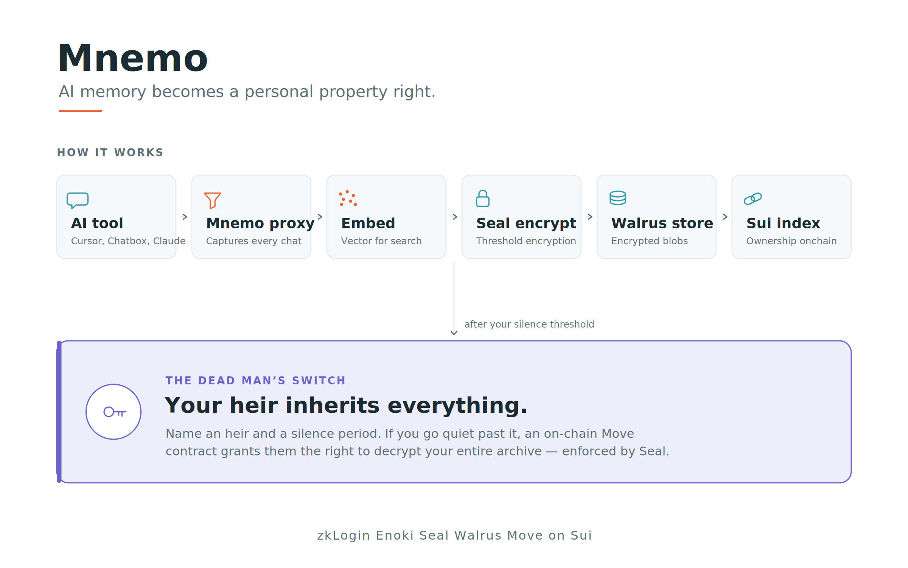

# Mnemo — Your AI memory, owned forever

Mnemo is an encrypted, portable, inheritable memory layer for your AI conversations.

Point any AI tool — Cursor, Chatbox, Claude, ChatGPT, or any app with a custom OpenAI/Anthropic endpoint — at your personal Mnemo proxy. Every conversation is automatically captured, encrypted with Seal, stored on Walrus, and indexed on Sui. Search years of AI conversations across every tool from one place — and because the access policy lives in a Move contract you control, you can pass your entire AI memory on to an heir through an onchain dead man's switch.

**Sui Overflow 2026 — Agentic Web Track**
Live demo: [URL] · Video: [URL]



---

## Why this matters

Your most valuable thinking increasingly happens with AI — debugging, drafting, deciding. But that history is trapped: scattered across vendors, locked inside each tool, tied to whichever model you used that day. Switch tools and you lose it. Cancel a subscription and it may be gone. And none of it survives you.

Mnemo makes your AI memory yours: encrypted so only you can read it, stored on decentralized infrastructure you control, searchable in plain language across every tool — and, uniquely, inheritable.

---

## What makes Mnemo different

Most Sui storage projects push blobs to Walrus. Mnemo does something no file uploader can: it turns Seal from "an encryption library" into a programmable, time gated access framework.

**61 of 61 Move tests passing.** This is a working system on Sui testnet, not a facade.

### The dead man's switch (our core differentiator)

You name an heir (any Sui address) and a silence threshold. Normal activity is a heartbeat that keeps your account alive. If you go silent past the threshold, an onchain Move contract grants your heir the ability to decrypt your archive — enforced by Seal's `seal_approve` policy checking a real time onchain clock.

Neither Mnemo nor anyone else can grant access early or deny it when conditions are met. The rule is the contract. This is programmable data inheritance — your AI memory outlives you, cryptographically.

### Real use of Sui's primitives (not mocked)

| Primitive | How Mnemo uses it |
|---|---|
| **Seal** | Threshold encryption (2 of 2 key servers) of every memory; decryption gated by an onchain Move policy. Encryption is performed by the MemWal relayer — see proof below. |
| **Walrus** | All encrypted memory blobs stored on Walrus; retrieved and decrypted on demand. |
| **Sui Move** | A forked and extended account module adds the heir / dead man's switch logic into the `seal_approve` access policy. |
| **zkLogin (Enoki)** | Passwordless Google sign in derives each user's Sui address. No seed phrase, no wallet install. |
| **Sponsored transactions (Enoki)** | Gas is sponsored — onboarding and inheritance cost the user nothing. |

**Onchain proof (testnet):**

- Package: `0x140618622e96fe604e8fd1e8a752e1fe44726cdb0622a18020a61955ce918a60`
- Module: `account` · AccountRegistry: `0xa13e1c5b27d1b5e41c780c3ed2a572219b20bf1c18c5a55f4289ab04e2f515f3`
- Explorer: https://testnet.suivision.xyz/package/0x140618622e96fe604e8fd1e8a752e1fe44726cdb0622a18020a61955ce918a60

A live capture produces logs like `seal encrypt ok: 374 bytes -> 723 encrypted bytes` followed by a real Walrus blob ID and onchain object ID — real Seal, real Walrus, real Sui, every time.

---

## How it works

1. **Sign in with Google.** zkLogin derives your Sui address; your account is auto provisioned onchain, gas sponsored.
2. **Point your AI tool at your Mnemo proxy.** Set it as the OpenAI/Anthropic base URL. Every conversation through that tool is captured.
3. **It's encrypted and stored.** The relayer embeds, Seal encrypts, uploads to Walrus, and indexes on Sui — automatically.
4. **Search everything.** Semantic search across all your captured conversations, any tool, any model, decrypted in your browser.
5. **Set an heir (optional).** Choose an address and a silence period. The onchain dead man's switch does the rest.

---

## Architecture

See the diagram above. In short: your AI tool talks to the Mnemo proxy (which forwards to OpenAI/Anthropic and captures asynchronously). A capture worker hands off to a Node sidecar, which bridges to the MemWal relayer — the relayer owns embedding, Seal encryption, Walrus upload, and Sui indexing. The Next.js web app (hosted on Walrus Sites) talks to a separate management API for search, keys, and memories.

Encryption and onchain operations are owned by the MemWal relayer (a self hosted fork of MystenLabs/MemWal); the sidecar bridges Python services to the Node only Sui SDKs. Provider API keys are encrypted at rest (envelope encryption); memories are encrypted with Seal.

| Service | Tech | Purpose |
|---|---|---|
| `apps/web` | Next.js + TS | Frontend (deep sea UI), hosted on Walrus Sites |
| `apps/proxy` | FastAPI | AI tool facing OpenAI/Anthropic proxy + capture |
| `apps/api` | FastAPI | Web app management API (search, keys, memories) |
| `apps/worker` | Python | Async capture pipeline |
| `apps/sidecar` | Node/Express | Relayer auth bridge to Sui SDKs |
| `packages/move` | Sui Move | `account` module: ownership + heir / dead man's switch |

---

## Security notes

Mnemo draws a deliberate line between two kinds of secrets, encrypted two different ways:

- **Your memories** are encrypted with Seal under an onchain access policy; stored ciphertext is unreadable without authorization — **including by Mnemo.** This is the user authorized model: only you (or your heir, once the contract allows) can decrypt.
- **Provider API keys** are encrypted at rest with envelope encryption. They must be used unattended on the request path, where Seal's user authorized model doesn't fit — so they use the standard approach for server held secrets. This is a considered tradeoff, not a gap: keys and memories have different threat models.

**Identity:** the closed testnet beta asserts the zkLogin derived address over an authenticated channel. Full server side JWT re verification is the scoped next step for mainnet — the upgrade is already gated behind a config flag in `apps/api/mnemo_api/auth.py`.

---

## Running locally

**Quick version for reviewers:** you need Postgres + pgvector and Redis (via `docker compose`), the MemWal relayer (testnet config), and the five Mnemo services. Full Windows first setup is in `SETUP.md`; per service detail is in `apps/*/README.md`.

```bash
docker compose up -d                      # Postgres + Redis
# start the MemWal relayer (testnet), then:
# sidecar (:3001), proxy (:8080), api (:8001), worker, web (:3000)
```

---

## Status

Working end to end on Sui testnet: capture → Seal encrypt → Walrus → onchain index → semantic search → decrypt, plus the heir / dead man's switch inheritance flow.
